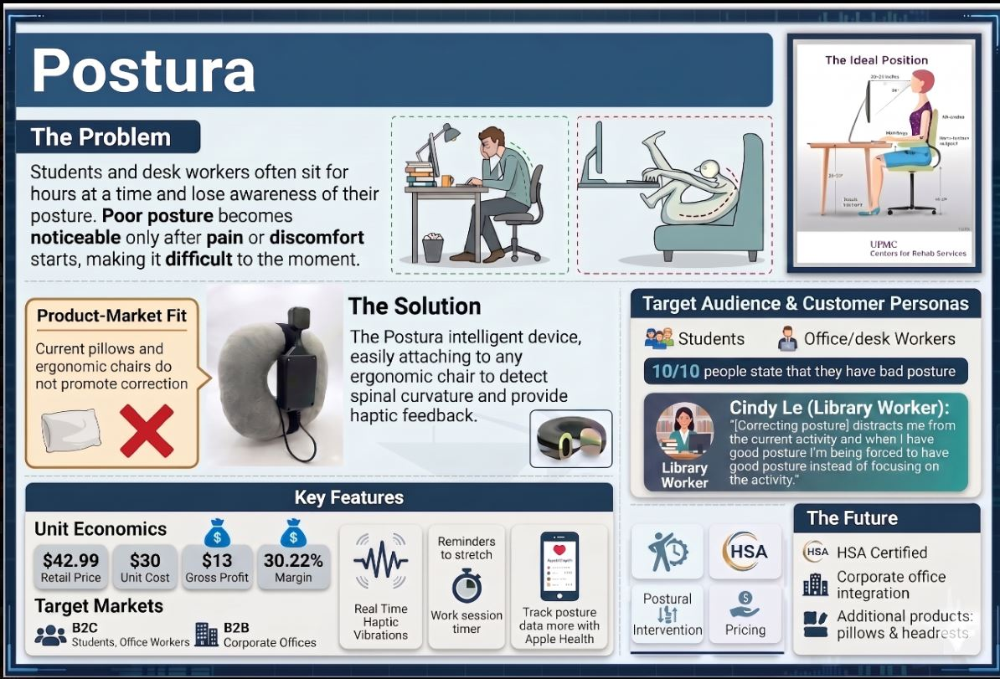
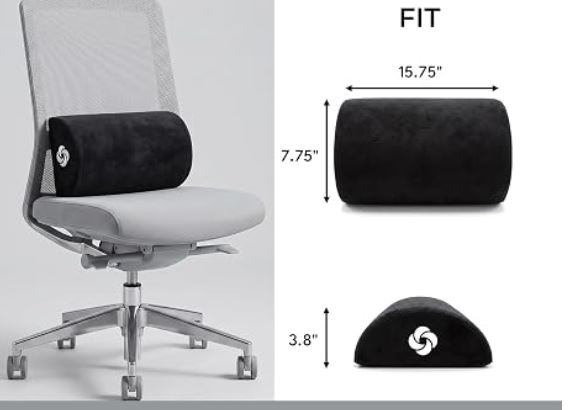
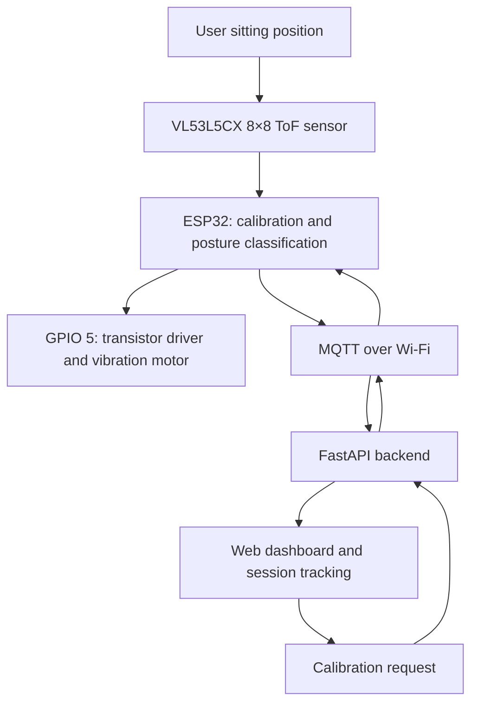
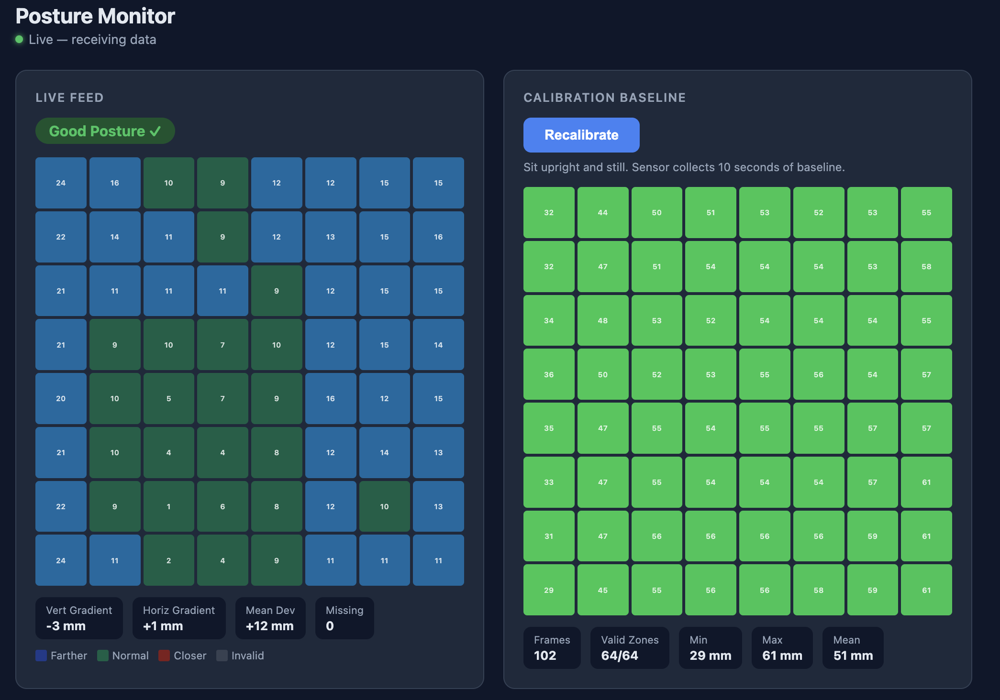
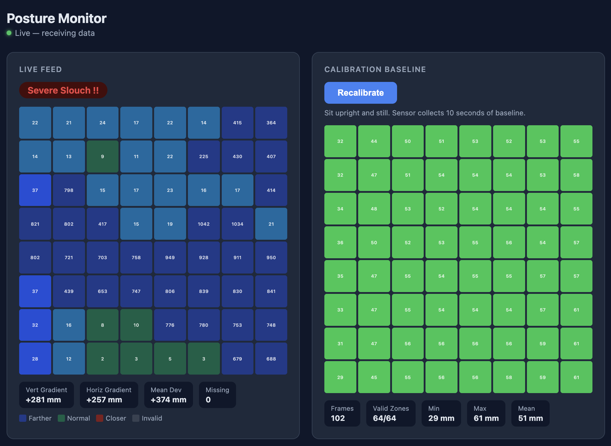
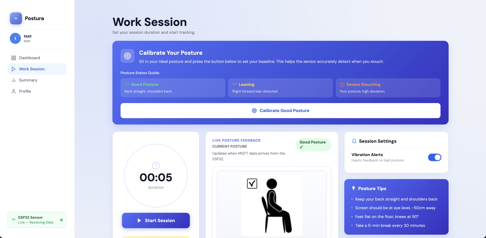
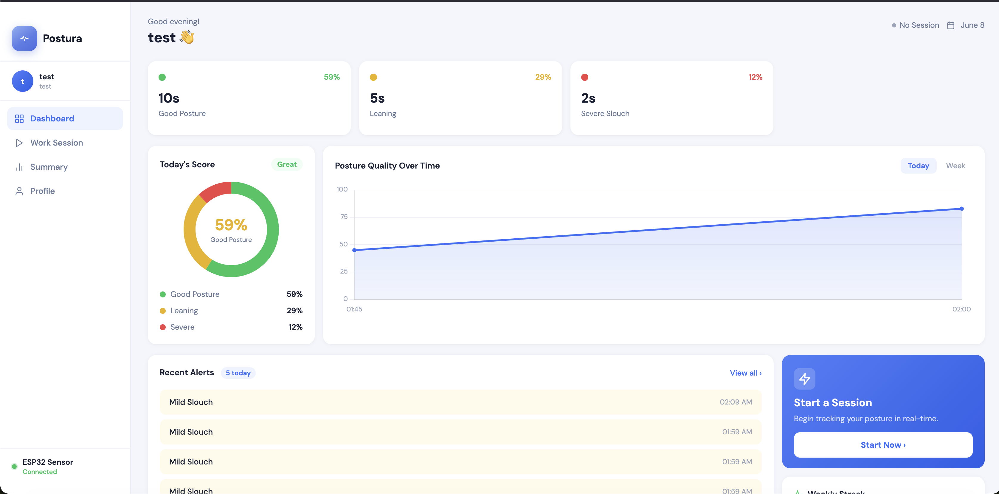
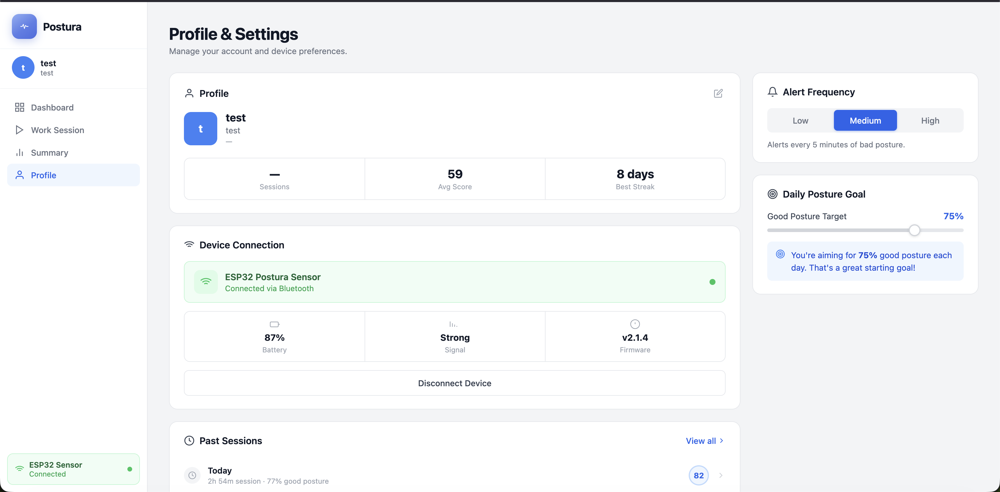
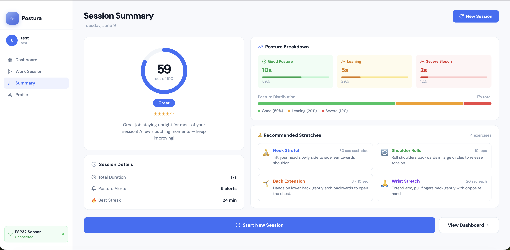
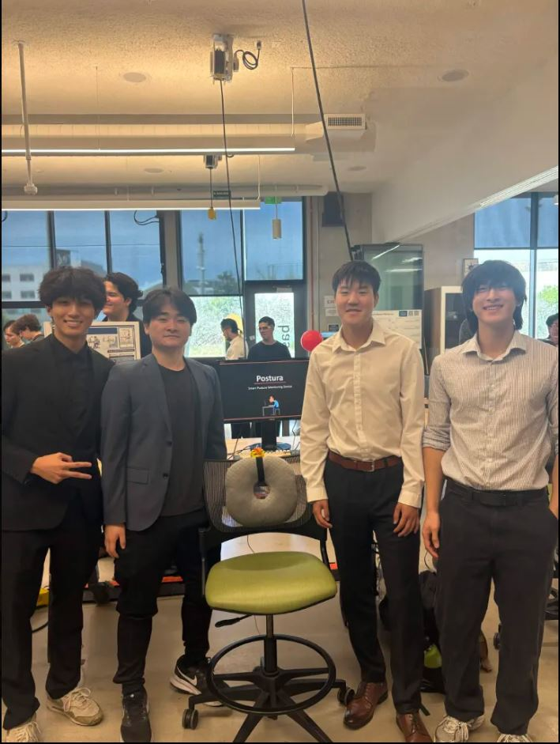

# Postura – Smart Posture Monitoring Device

Postura is a chair-mounted posture monitoring prototype developed for **UCSD ECE 140B**. It uses an ESP32, a VL53L5CX 8×8 time-of-flight sensor, and vibration feedback to help users notice slouching during long study or work sessions.

My role focused on **hardware integration, sensor testing, vibration feedback, prototype design, and customer validation**.

## Demo

[Watch the Postura demo](https://youtu.be/FTXZTZuFShc)

## Project Overview

Students and desk-heavy professionals often lose awareness of their posture while concentrating and only notice it after discomfort begins. Postura provides a quiet reminder when the user's position changes from a calibrated upright baseline.

The chair-mounted design avoids the need to put on a wearable device. A web dashboard displays posture information, tracks sitting sessions, and encourages regular movement breaks.

## My Contributions

- Integrated the ESP32, ToF sensor, and vibration motor.
- Supported prototype wiring, power setup, and physical mounting.
- Helped develop and test vibration feedback.
- Tested upright sitting, mild slouching, severe slouching, and leaning back.
- Conducted customer interviews to understand sitting habits and product preferences.
- Helped define the product’s value proposition and business model.

The firmware and web applications were developed as a team. This repository presents the complete project alongside my individual contributions.

## Project Poster

*Click the poster to view it at full size. Apple Health integration and HSA purchasing options shown on the poster were proposed future directions.*

## Prototype

*Early prototype exploring a pillow-based form factor and lower lumbar support.*

## Key Features

- 64-zone distance sensing with upright baseline calibration
- Classification of good posture, mild slouch, severe slouch, and leaning back
- Single vibration motor for quiet feedback
- Wi-Fi/MQTT communication between the ESP32 and backend
- FastAPI web interface for posture monitoring and session tracking
- Posture scores, session summaries, and CSV data logging
- Break reminders and suggested stretches

## System Architecture

The ESP32 classifies posture and controls the motor locally. MQTT carries sensor data to the web application and calibration commands back to the device.

## Hardware Components

| Component | Purpose |
|---|---|
| ESP32 | Sensor processing, posture classification, and wireless communication |
| VL53L5CX ToF sensor | Measures distance across an 8×8 sensing grid |
| Single vibration motor | Provides haptic feedback |
| NPN transistor, 1 kΩ resistor, and flyback diode | Switch and protect the motor driver circuit |
| Rechargeable battery | Powers the portable prototype |
| 3D-printed housing and chair/pillow mount | Holds and positions the electronics behind the user |

### Vibration Feedback

The physical prototype used **one motor connected through a driver circuit to GPIO 5**. The firmware also defines GPIO 9 for a second motor, but that output was not connected.

| Posture classification | Motor response |
|---|---|
| Good posture | Off |
| Mild slouch | Pulsed vibration |
| Severe slouch | Continuous vibration |
| Leaning back | Off |

The motor is switched through an NPN transistor with a 1 kΩ base resistor and a flyback diode across the motor.

## Software Components

| Folder | Purpose |
|---|---|
| [`esp32/`](esp32/) | PlatformIO firmware for sensing, calibration, posture classification, motor control, and MQTT |
| [`website/`](website/) | Main FastAPI application with accounts, work sessions, dashboard views, and logging |
| [`python/`](python/) | Standalone FastAPI sensor dashboard for visualization, calibration, and labeled data collection |

### Why Are There Two Web Applications?

Both `website/` and `python/` include MQTT communication, WebSocket updates, calibration controls, and CSV logging.

They run independently. The main website provides the fuller user-facing experience, while the standalone dashboard supports sensor testing and data collection. The website does not require `python/server.py`.

Both default to port 8000, so run one at a time unless different ports are configured.

## Sensor Readings and Posture Detection

The sensor dashboard visualizes the 8×8 sensing grid alongside the calibrated upright baseline. Changes across the sensor zones support threshold-based posture classification.

### Good Posture

*An example classified as good posture, displayed alongside the calibration baseline.*

### Severe Slouch

*Changes across the sensing grid produce a severe-slouch classification, which triggers vibration feedback.*

These screenshots document prototype behavior rather than a measured classification-accuracy result. They show an earlier interface that labels calibration as 10 seconds; the included firmware uses five seconds.

## Website and Session Tracking

The website displays time spent in different posture states and uses these statistics to produce a posture score and session summary.

Break reminders encourage regular movement during long sitting sessions. The interface also presents information about prolonged sitting and suggested ergonomic stretches.

**Prototype interface note:** Some fields in these screenshots are demonstration placeholders, including the Bluetooth label, battery percentage, firmware version, streak values, and parts of the trend/alert presentation. The implemented device connection uses Wi-Fi/MQTT.

### Work Session

*Calibration controls, session timer, live posture feedback, and posture tips.*

### Posture Dashboard

*Posture distribution and score, with prototype trend and alert displays.*

### Profile and Settings

*Prototype interface for account information, device status, alert preferences, and posture goals.*

### Session Summary

*Session score, posture breakdown, session details, and suggested stretches.*

## Setup Guides

- [ESP32 firmware setup](esp32/README.md)
- [Main website setup](website/README.md)
- [Standalone sensor dashboard setup](python/README.md)

Live readings require an ESP32 publishing to the same MQTT broker and topic prefix as the selected application.

## Customer Discovery

We interviewed students and desk-heavy professionals to understand their sitting habits, existing solutions, and preferences.

[Read the customer discovery findings](docs/customer-discovery.md)

## Business Model

The proposed business model uses a one-time purchase with two options:

| Version | Estimated Selling Price | Estimated Unit Cost | Gross Profit per Unit |
|---|---:|---:|---:|
| Standard device | $22.99 | $12.00 | $10.99 |
| Pillow upgrade | $42.99 | $30.00 | $12.99 |

These are class-project estimates. Gross profit shown is selling price minus estimated unit cost, before other business expenses.

## Challenges and Lessons Learned

**Balancing feedback with distraction:** Customer interviews emphasized that reminders should not interrupt studying or work. This supported quiet vibration feedback and a passive mounting approach.

**Distinguishing posture from normal movement:** Reaching, shifting, and changing position can affect sensor readings. Reliable behavior depends on calibration, sensor placement, and further testing across users and chairs.

**Connecting hardware and software:** Matching MQTT settings and checking sensor readings alongside dashboard output helped with integration and debugging.

## Future Improvements

- Add a pause/on-off feature for normal movement.
- Reduce false alerts across different users and chairs.
- Conduct longer-term usability and classification testing.
- Improve session history and replace remaining interface placeholders.
- Explore mobile app support and Apple Health integration.

## Team

Developed by **Group 12** for **UCSD ECE 140B**:

- Aden Tan
- Alex Wei
- Colin Hua
- Richard Kim

[Original team repository](https://github.com/rkim1026/ECE140B-Postura)

